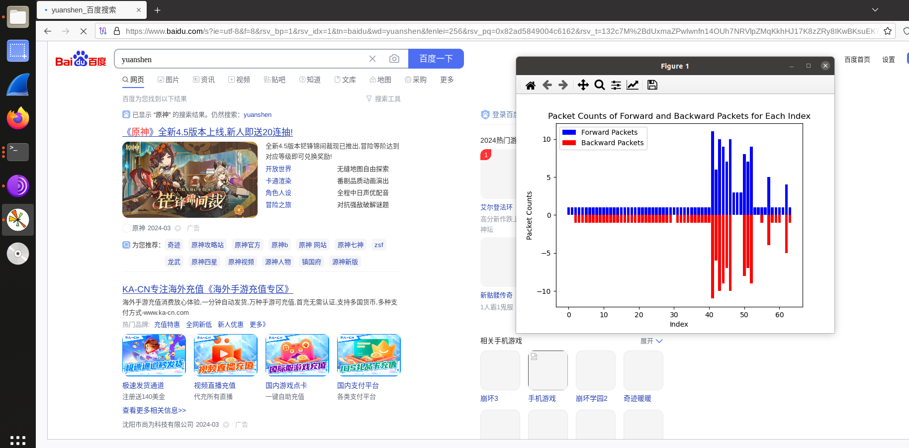
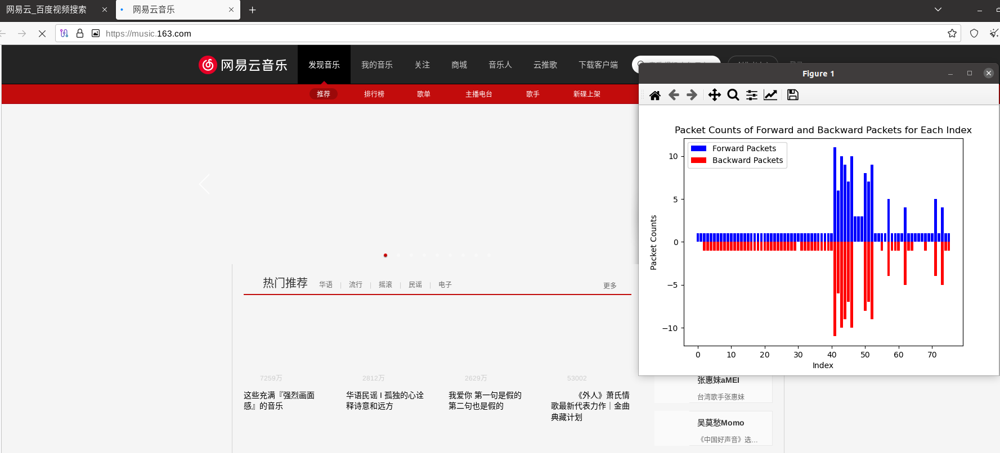
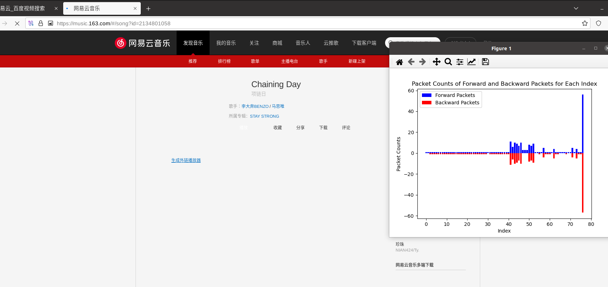

Zeek是一个开源的、被动网络流量分析软件。它主要被用作安全监测设备来检查链路上的所有流量中是否有恶意活动的痕迹。但更普遍地，Zeek支持大量安全领域外的流量分析任务，包括性能测量和帮助排查问题。

在一个地方部署Zeek，将会得到大量不同类型的*日志文件*，它们详细记录了当前网络中的活动信息。我们的恶意流量检测系统要在使用胜读学习的方法分析的同时进行可视化，这要求在在线使用zeek的捕获流量同时，同时输出日志文件以供系统分析。这里以包级流量为例（实际不止如此），我展示其简单可视化的过程。


在zeek/sahre/zeek/site/local.zeek加：

```
@load policy/tuning/json-logs.zeek
```

使得可以以json形式的日志。

```
@load packages
```

zeekctl要以root账户运行，而不是仅仅授权。


## 问题思考：

#### 1.实时分析

要对Zeek实时生成的日志文件进行，您可以考虑使用以下方法：

1. **ELK Stack**：ELK（Elasticsearch、Logstash、Kibana）是一个流行的日志管理和分析解决方案。您可以使用Logstash将Zeek生成的日志文件发送到Elasticsearch进行存储和索引，然后使用Kibana进行实时的数据可视化和分析。
2. **Grafana**：Grafana是一个开源的指标度量和分析工具，通常与时序数据库配合使用。您可以将Zeek生成的日志数据发送到时序数据库（如InfluxDB），然后使用Grafana从中查询数据并进行实时的图表展示和分析。
3. **自定义脚本**：您也可以编写自定义脚本来处理Zeek生成的日志文件。使用一种编程语言（如Python）编写脚本来监视日志文件的更新，并实时分析和处理数据，然后将结果可视化或存储到所需的格式中。
4. **使用Zeek自带的工具**：Zeek自带了一些工具和脚本，可以帮助您分析和处理日志文件。您可以编写自定义脚本，利用这些工具实时处理和分析Zeek生成的日志数据。

以上方法中，ELK Stack和Grafana是相对较为常见且强大的工具，可以满足您对实时分析和可视化的需求。不过，具体选择哪种方法还取决于您的环境、技术栈和个人偏好。**这里选用3**，例如：

```
#以统计每一个五元组流的包数，conn.log文件为例
import os
import time

# 定义用于存储五元组流的字典
flow_packets = {}

# Zeek生成的conn日志文件路径
log_file_path = '/path/to/your/conn.log'

# 定义函数用于解析日志文件
def parse_log_file(log_file_path):
    ......

# 主循环，每隔一段时间处理一次日志文件
while True:
    # 解析日志文件
    parse_log_file(log_file_path)
    
    # 输出统计结果
    for flow, packets in flow_packets.items():
        print(f"Flow: {flow}, Packets: {packets}")
    
    # 清空统计数据
    flow_packets = {}
    
    # 暂停一段时间再继续处理
    time.sleep(10)

```


#### 2.实时更新图形

在使用 Matplotlib 这样的绘图库时，您可以使用交互式绘图的方式来实时更新图形

```
import matplotlib.pyplot as plt
import numpy as np
import time

# 初始化数据
x = np.arange(0, 10, 1)
y = np.random.rand(10)

# 创建初始图形
fig, ax = plt.subplots()
line, = ax.plot(x, y)

# 更新数据和图形的函数
def update_data_and_plot():
    global x, y
    x = np.append(x[1:], x[-1] + 1)  # 移动 x 轴
    y = np.append(y[1:], np.random.rand(1))  # 更新 y 数据
    line.set_xdata(x)  # 更新图形数据
    line.set_ydata(y)
    ax.relim()  # 调整坐标轴范围
    ax.autoscale_view()  # 自动调整坐标轴
    plt.draw()  # 绘制图形

# 持续更新图形
while True:
    update_data_and_plot()
    plt.pause(1)  # 暂停一段时间再更新，这里是 1 秒

```


## 设计思路：

zeekctl实时监控网卡--> 生成logs/current/下的日志文件-->另开一个进程py文件读取日志文件（panda，sklearn格式），实时分析，作图(matplotlib等可视化工具)

zeekctl退出自动删除log文件（start的话），考虑抛出，未收到不显示

美化的话也可写个ui界面，或者前端网站


## 遇见问题：

1.在zeekctl里开始时：

```
可以在/usr/local/zeek/share/zeek/site#打开终端解决，否则报sendmail错，也可以用安装方法解决。这里应该是我自己的环境变量问题。
```


2.plt.show()的堵塞问题，考虑多线程，行不通，matplotlib默认单线程，这里使用matplotlib的动态更新功能

```
from matplotlib.animation import FuncAnimation
# 创建动画
ani = FuncAnimation(plt.gcf(), update_graph, interval=1000)  # 每秒更新一次
plt.show()

```


## 源程序：

#### 依赖：

```
(py39) [03/20/24]seed@VM:~$ conda list | grep panda
pandas                    1.5.2            py39h417a72b_0  
(py39) [03/20/24]seed@VM:~$ conda list | grep matplo
matplotlib                3.7.1            py39h06a4308_1  
matplotlib-base           3.7.1            py39h417a72b_1  
matplotlib-inline         0.1.6            py39h06a4308_0  
(py39) [03/20/24]seed@VM:~$ ^C
(py39) [03/20/24]seed@VM:~$ zeek -v
zeek version 4.2.0
```


#### 程序：

因为在flowmeter里，我这里只选用了前进和后退包数，想加上分析其他属性同理，这在panda里也很容易实现，这里关键在于解决程序和日志文件的输出实时性问题。

```
import pandas as pd
import json
import time
import matplotlib.pyplot as plt
from matplotlib.animation import FuncAnimation

file_path = '/usr/local/zeek/logs/current/flowmeter.log'

def update_graph(frame):
    with open(file_path, 'r') as file:
        data = file.readlines()

    # 如果数据不为空，则处理
    if data:
        # 将JSON数据转换为DataFrame
        df = pd.DataFrame([json.loads(entry) for entry in data])

        # 提取正向和负向数据包数量
        fwd_values = df['fwd_pkts_tot'].tolist()
        bwd_values = [-val for val in df['bwd_pkts_tot'].tolist()]  # 取负值

        # 创建绘图所需的数据
        indices = df.index.tolist()

        # 清除当前图形
        plt.clf()

        # 绘制柱状图
        plt.bar(indices, fwd_values, color='b', label='Forward Packets')
        plt.bar(indices, bwd_values, color='r', label='Backward Packets')
        plt.xlabel('Index')
        plt.ylabel('Packet Counts')
        plt.title('Packet Counts of Forward and Backward Packets for Each Index')
        plt.legend()

# 创建动画
ani = FuncAnimation(plt.gcf(), update_graph, interval=1000)  # 每秒更新一次

plt.show()
```


使用：

```
sudo zeekctl
start
#这会生成zeek/log/current/下的日志文件，stop和exit时会自动打包日期命名

#打开tor浏览器
./tor-browser/Browser/start-tor-browser &
#随意访问一个网页(这里没有做异常抛出，最好是先开个网页以生成flwometer.log文件)

#另开一个进程执行zeek_3.py
python3 zeek_3.py

#更换网站，可以看到实时更新的图
```


## 结果：

实时监控生成图：








#### 改进：

后面可以对flowmeter.log文件里的属性进行分析，看看到底是有哪一些。